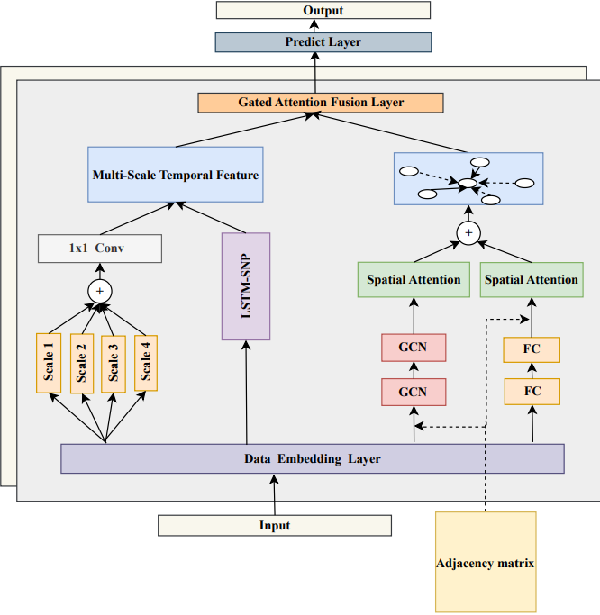

# The overview of model architecture

# Datasets
- **PEMS03**, **PEMS04**, **PEMS07** and **PEMS08** from [STSGCN (AAAI-20)](https://github.com/Davidham3/STSGCN).
# Quick start
1. Install the required packages
```bash
pip install -r requirements.txt
```
2. Run the training script
```bash
bash train.sh
```
3. Run the evaluation script
```bash
python test.sh --dataset <dataset> --model <model> --checkpoint <checkpoint>
```
